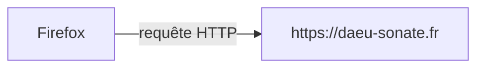
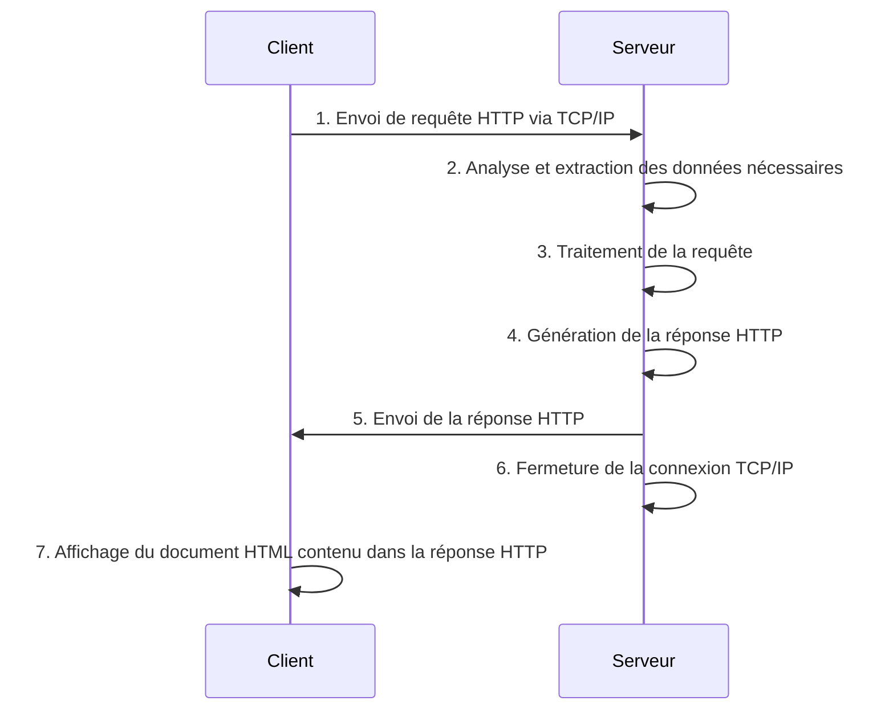

# Introduction

## Principes

Flask est un *framework* (patron de conception) développé en Python pour la conception de sites web.
Il permet d'exécuter du code Python et de l'exploiter selon un modèle de communication ***client-serveur***.


### Exemple avec des noms d'applications :




### Fonctionnement :

Le schéma ci-dessous décrit un exemple de séquence d'émission / réception de requête HTTP par un client (ex: navigateur) et un serveur web.



Cette séquence d'événements est généralement très rapide, le tout dépendant de la connexion dont dispose le client, des ressources du serveur et de la distance qui sépare physiquement le client et le serveur.

Plus le serveur web à qui s'adresse la requête est éloigné géographiquement (autre continent par exemple), plus le temps de réponse est long. En effet, la requête HTTP est émise sous forme de paquets (blocs de données) envoyés à travers le réseau internet mondial. Cela implique de passer par une multitude d'appareils réseau (routeurs, etc.). Plus la distance et le nombre d'intermédiaires sont importants, plus le temps de réponse est long.

Il est donc important de choisir un serveur physiquement proche géographiquement de ses utilisateurs, afin de réduire le temps de réponse.

## Flask

Le framework Flask dispose d'outils pré-conçus pour gérer le routage des requêtes HTTP. La mise en place de toute la mécanique nécessaire pour gérer le fonctionnement illustré dans le schéma ci-dessus est complexe et il n'est pas conseillé de faire sa propre mouture, sauf pour des raisons pédagogiques. La compréhension de son fonctionnement est suffisante.

### Site web

[https://flask.palletsprojects.com](https://flask.palletsprojects.com)

### Pré-requis

- Python 3.8 minimum

### Installation

Pour installer Flask, on utilisera l'outil d'installation livré avec Python 3 nommé `pip`.

[https://flask.palletsprojects.com/en/3.0.x/installation/#install-flask](https://flask.palletsprojects.com/en/3.0.x/installation/#install-flask)

La commande suivante permet d'installer Flask depuis un terminal :

```bash
pip install Flask
```

On utilisera cependant une autre méthode dans le cadre de ce projet pour installer Flask.
